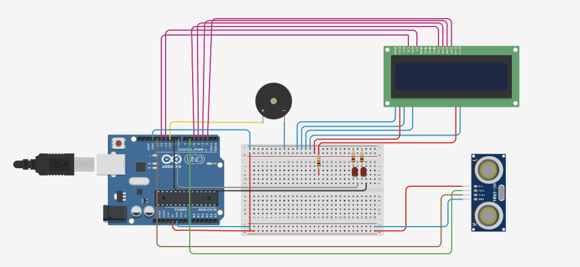
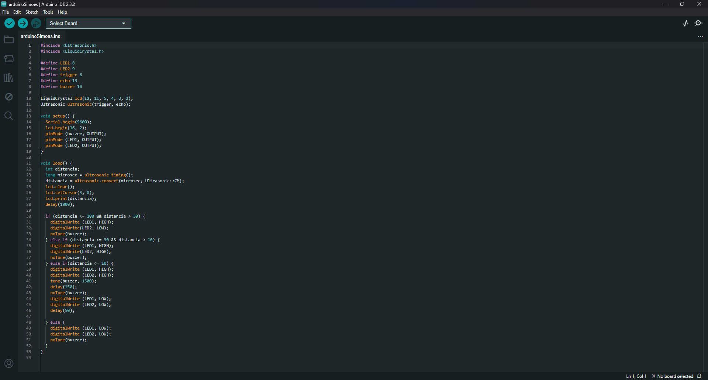
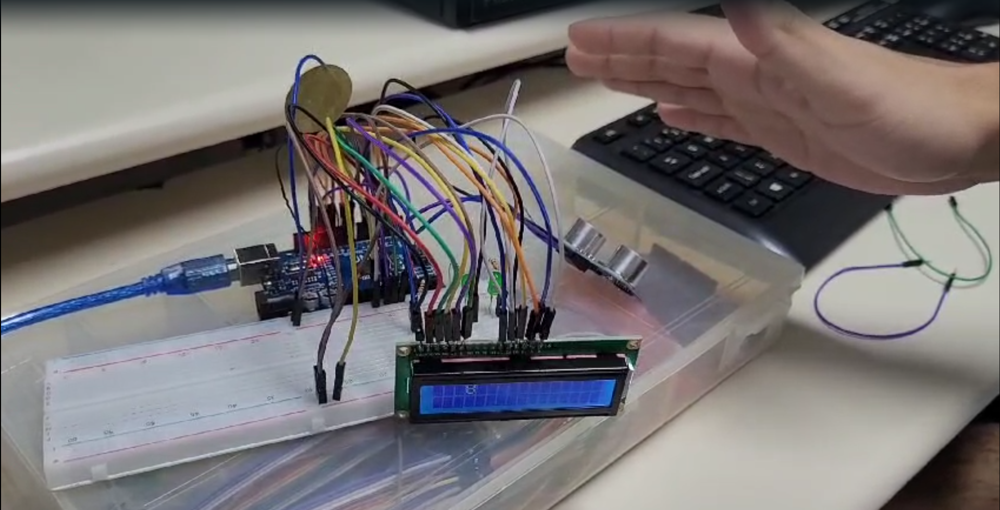

# Sensor de distância usando Arduino
## Descrição
Projeto da disciplina _Eletrônica para Computação_, desenvolvido pelos alunos da USP da São Carlos.
O trabalho teve como objetivo criar um sensor de ré de carro utilizando Arduino.

### Lista de componentes
| Componente | Qtd | Total R$ |
| ---------- | --- | -------- |
| Protoboard | 1 | emprestado |
| Arduino UNO | 1 | 44,99 |
| Sensor ultrassônico | 1 | 9,50 |
| Display LCD | 1 | emprestado |
| Pastilha piezoeletrônica | 1 | 8,00 |
| LED vermelho | 2 | emprestado |
| Resistor 330Ω | 3 | 3,43 |

## Vídeo do funcionamento
https://www.youtube.com/watch?v=vjuF8KF7MFA&ab_channel=ArturDomitti

## TinkerCad

https://www.tinkercad.com/things/6XPkUNkfPQF-shiny-wolt-borwo/editel?sharecode=JWtsEgQUqherwgIMz7KNJmGeQdjleXHCWEfBBcNK-Lg

## Software

## Foto do projeto

## Membros do grupo
  * Artur Domitti Camargo - 15441661
  * Lucas Mello Ciosaki - 145913051 

